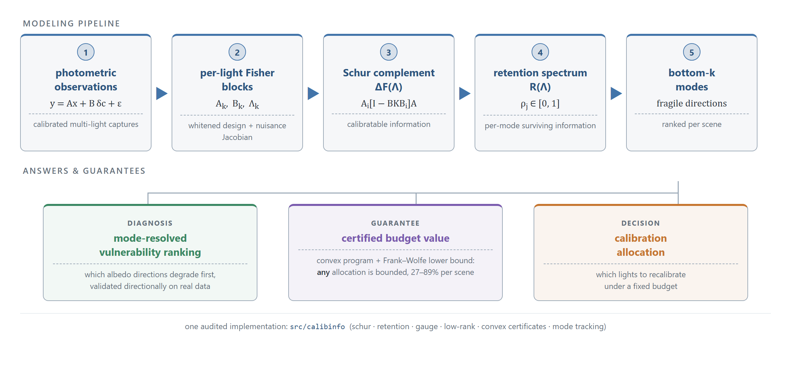
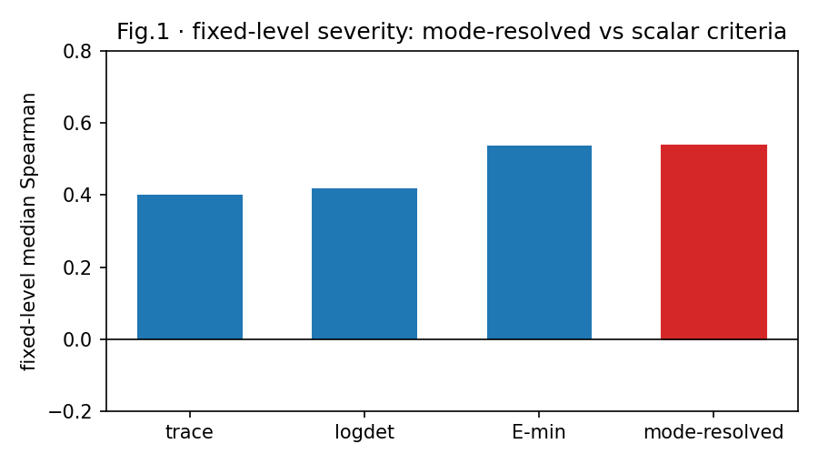
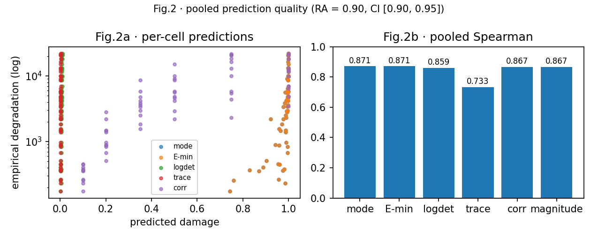
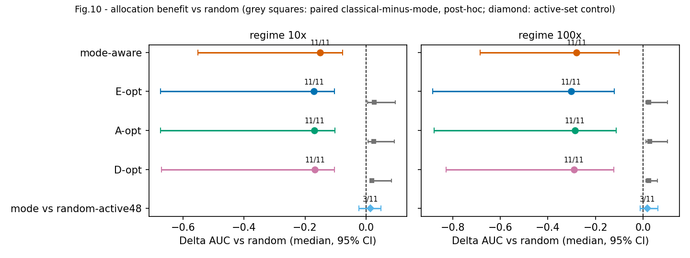
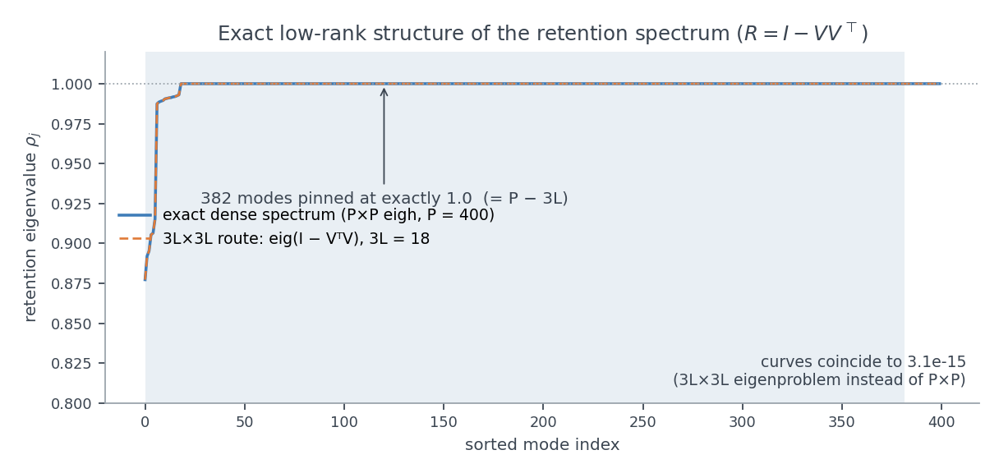
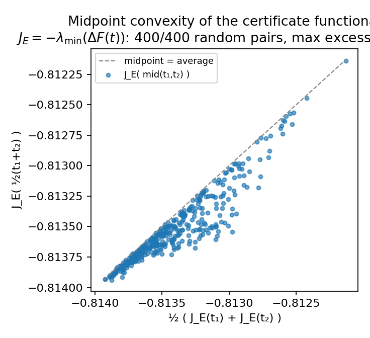

English · [简体中文](README.zh-CN.md)

# mode-resolved-calibration

[](https://github.com/dddsx3/mode-resolved-calibration/actions)
[](LICENSE)

**calibinfo** is a Python library for mode-resolved calibration-confidence
analysis of linearized inverse problems with structured nuisance. Instead of
compressing an estimator's information content into scalar summaries (trace,
log-determinant, E-optimality), it tracks the *weakest identifiable modes* of
the Fisher information — how much usable signal survives in each fragile
direction as calibration uncertainty grows. The framework exposes which
identifiable directions and calibration components are information-active. A
downstream allocation stress test shows that identifying the Fisher-active
substructure has decision value, while no additional performance advantage is
observed for the tested within-active-set mode ordering.

The current research direction is a **certified analysis of
calibration-precision allocation**: the budget-allocation problem is an exact
convex program in the per-light precision multipliers, the retention spectrum
has an exact low-rank structure that removes the sampling bottleneck, and the
optimization landscape itself — not any particular policy — is certified
(see [Research direction](#research-direction-certified-bounds-on-calibration-precision-allocation)).
The mathematical statements are collected in
[docs/methods.md](docs/methods.md); every number in this README is bound to a
committed evidence file in [docs/claims.md](docs/claims.md).



## Quickstart

```python
import numpy as np
from calibinfo.information.schur import delta_f
from calibinfo.information.retention import retention_spectrum

# linearized model  y = A x + B dc + eps,  dc ~ N(0, Sigma_c)
A = ...                      # (m, n) design for the parameters of interest
B = ...                      # (m, q) design for the nuisance block
Lam = ...                    # profiling precision  Lambda = sigma^2 * Sigma_c^{-1}
                             # (requires Sigma_c > 0; for singular Sigma_c use
                             #  delta_f_marginal / the factor path C = B L)

DeltaF, M, diag = delta_f(A, B, Lam)                 # Schur-complement information
spec = retention_spectrum(DeltaF, A.T @ A)           # normalized per-mode retention
# spec["rho"] (ascending) are the generalized retention eigenvalues on the
# identifiable subspace range(F_inf); spec["modes"] are the corresponding
# eigenvectors — the fragile directions the library tracks
```

See `examples/` for complete runnable scripts — each generates its own synthetic
data and figures on the fly, no downloads required.

## Features

- **Schur-complement delta-Fisher information** `ΔF(Λ)` with a single audited
  implementation (SVD/lstsq paths; no raw solves on rank-deficient systems)
- **Calibration-retention spectrum** `R(Λ) = F∞^{-1/2} ΔF(Λ) F∞^{-1/2} ∈ [0, I]`
  on the identifiable subspace `range(F∞)` — dimension `r = rank(F∞)` (not the
  nuisance dimension `q`) — with per-mode retention levels and continuous mode
  tracking across Λ
- **Closed-form gauge response** `aᵀΔF(λ)a = Σᵢ αᵢ² sᵢ² λ/(sᵢ²+λ)` for gauge
  directions, with the λ⋆ directional crossover precision diagnostic
  (existence condition `0 < μ < ‖Aa‖²`; within-scene interpretation only)
- **Singular-covariance-safe marginal routes**: `delta_f_marginal` and the
  covariance-factor path `Σ_c = LLᵀ, C = BL` handle any proper `Σ_c ⪰ 0`
- **Known-answer test suite**: LO monotonicity, rank-deficient Λ = 0 routes,
  gauge identities, per-light allocation sensitivity (analytic vs finite
  difference), brute-force greedy cross-checks, retention-covariance theorem,
  allocation rank invariance
- **Information-guided calibration allocation**: per-light sensitivity kernels,
  sequential selection under a precision budget, compared against E/A/D-optimal
  greedy (A/D on the positive subspace as implemented) and random baselines.
  The tested mode-aware ordering is an adaptive normalized weak-Fisher-mode
  sensitivity heuristic, not an exact retention-gradient optimization
- **Deterministic paired evaluation protocol**: shared raw innovations across
  policies/budgets, object-level paired bootstrap

## Mathematical core

1. Model and nuisance priors:

   `y = A x + B δc + ε`,   `δc ~ N(0, Σ_c)`,   `Λ = σ² Σ_c⁻¹` (Σ_c ≻ 0)

   `Λ` is a **profiling precision** (the PSD penalty matrix of the quadratic
   `cᵀΛc`; its null directions are flat/unpenalized). For a *singular* proper
   Gaussian covariance — whose null directions mean "almost surely zero", the
   opposite semantics — use the covariance-factor marginalization
   `Σ_c = LLᵀ, c = Lz, C = BL` (`delta_f_marginal`, `nuisance_factor`), never a
   pseudoinverse-precision substitution.

2. Delta-Fisher (Schur complement, the `calibratable` residual information):

   `ΔF(Λ) = Aᵀ [ I − B (BᵀB + Λ)⁻¹ Bᵀ ] A`

3. Calibration-retention spectrum (generalized eigenvalue problem
   `ΔF v = ρ F∞ v`, restricted to `𝒳 = range(F∞)`):

   `R(Λ) = F∞^(−1/2) · ΔF(Λ) · F∞^(−1/2)`,   `0 ≼ R(Λ) ≼ I`

   The eigenvalues `0 ≤ ρ₁ ≤ … ≤ ρ_r ≤ 1`, `r = rank(F∞)`, are per-mode
   retention levels; the weakest (bottom) modes are the smallest eigenvalues of
   `R(Λ)`, and the mode-resolved criterion tracks those bottom modes across the
   hyperparameter path. ρ_j is a generalized Rayleigh quantity `v_jᵀΔFv_j /
   v_jᵀF∞v_j` — not a ratio of ordinary eigenvalues of the two matrices. Under
   the matched linear-Gaussian GLS ensemble, `1/ρ_j` is exactly the variance
   inflation of the normalized dual error coordinate
   `z_j = u_jᵀ F∞^{1/2}(x̂ − x)` (`F∞^{1/2} Cov(x̂) F∞^{1/2} / σ² = R⁻¹`).

4. Gauge spectral response (closed form):

   `aᵀΔF(λ) a = Σᵢ αᵢ² sᵢ² λ / (sᵢ² + λ)`,   `(sᵢ², V) = eig(BᵀB)`,   `α = Vᵀ c̄`

## Examples

`examples/` contains self-contained scripts that generate their own synthetic
data and figures — clone-and-run, zero downloads:

- retention spectrum and gauge response on a synthetic scene
- mode-resolved vs scalar criteria under controlled nuisance corruption
- a minimal calibration-allocation demo (small grid, runs in minutes)
- a two-question guided tour: which directions are fragile, and what a
  recalibration budget buys (certified) — shown below


## Benchmark reproduction

The `results/`, `configs/`, and `experiments/` trees hold a frozen benchmark
(OpenIllumination controlled-corruption study + DiLiGenT sanity + synthetic
validity panels) whose numbers, protocols, and provenance are documented in
`docs/REPRODUCIBILITY.md` and `docs/EXPERIMENTS.md`, guarded by
`tests/test_reproduction.py`. This benchmark is separate from the library API
— the examples above never touch it. Every headline number below is bound to
a committed evidence file in [docs/claims.md](docs/claims.md).

Key results (11 held-out OpenIllumination objects). Numbers use the
**corrected pipeline** (see *Correctness & integrity* below); the original
pipeline's outputs are kept as a reference record.

- **Directional validation**: median within-cell Spearman $R_A$ = 0.90
  (object-cluster bootstrap 95% CI [0.7, 0.95]; 65/66 cells positive, 11/11
  objects positive). **Important caveat**: within a cell this statistic
  is by construction equivalent to ranking by mode index
  (`Spearman(−j, ·)`; per-cell deviation exactly 0.0 on 66/66 cells — `results/magnitude/directional_amplitude_summary.json`). What it
  validates is *directional*: the retention operator's bottom tracked
  directions are the empirically more fragile directions inside a given
  problem instance. It does **not** validate the predicted magnitudes
  `1/ρ_j`;
- **Amplitude validity envelope**: on real data the empirical/predicted
  degradation ratio has median 201.1 (5–95% [7.3, 1525.8]), against 1.0045 on
  synthetic matched Monte-Carlo — the matched-GLS variance theorem holds where
  its assumptions hold, and the real-data deviation is reported as a positive,
  falsifiable validity envelope of the linearized theory;
- preregistered allocation evaluation: mode-aware guidance improves
  reconstruction over random allocation for 11/11 objects (Δ AUC −0.150 at 10×,
  −0.279 at 100×; bootstrap 95% CI excludes 0 — an actionable outcome vs
  random; the classical E/A/D-opt baselines improve similarly). In post-hoc
  paired comparisons the classical baselines achieved modestly lower AUC than
  the mode-aware policy (paired bootstrap 95% CIs exclude 0 in both regimes;
  median paired difference +0.019 to +0.027 AUC). The `random_active48` control
  — uniform permutations over the 48 Fisher-active lights only — removes the
  advantage over random entirely (Δ +0.014 / +0.019, CIs spanning 0), so the
  measured benefit of every informed policy over full-universe random is an
  active-set effect rather than a mode-ordering effect (see
  `allocation_policy_pairwise.csv` and `allocation_random48_summary.json`).
- **Pre-correction record (original pipeline; kept for reference)**: $R_A$ = 0.90
  (CI [0.90, 0.95]); stratified (fixed-level) median Spearman 0.536
  (mode-resolved) vs 0.418 (log-determinant) / 0.400 (trace). The stratified
  severity-comparison claim is **retired** after the corrected-interface
  rerun — it does not survive the corrected noise fit (corrected pipeline
  stratified −0.495; the flip is isolated to the noise-fit correction) — and
  must not be cited as a headline.







### Correctness & integrity

Two pipeline-interface details were corrected and re-verified on the
identical frozen protocol (same objects, pixel subsets, levels, seeds): the
heteroscedastic noise-fit coefficient order and the normalized
dual-coordinate mode projection. A preregistered A/B/C/D factorial
(`experiments/openillumination_factorial.py`,
`results/openillumination/correctness/mf0_factorial_summary.json`) validates
the machinery and re-measures every headline under the corrected interface:

- re-running with the original settings reproduces the frozen benchmark
  bit-for-bit (max relative difference 0.0 on every pred/emp entry and on
  the pooled Spearman);
- the within-cell directional-validation result is unchanged under the
  corrected interface: $R_A$ = 0.90 (bootstrap 95% CI [0.7, 0.95], 65/66
  cells positive, 11/11 objects positive);
- the fixed-level scalar-severity association does not survive the corrected
  noise fit (stratified −0.495 vs +0.536; the flip is isolated to the
  noise-fit correction), so that claim is retired — the corrected pipeline
  is the reported one regardless of direction (decided before the rerun).

All doc-facing numbers come from the corrected pipeline; see
[docs/claims.md](docs/claims.md) for the claim→evidence bindings.

## Research direction: certified bounds on calibration-precision allocation

The active research program repositions the project from "mode-resolved beats
scalar summaries" (three times falsified, and explained by the results below)
to a statement that is harder to overturn and more broadly useful:

> **How much can calibration-precision allocation buy at all?** The
> budget-allocation problem is reformulated as an exact convex program in the
> per-light precision multipliers, and the *optimization landscape itself* is
> certified — with Frank–Wolfe duality-gap certificates and exact dynamic-range
> bounds, independent of any particular selection policy.

Three structural findings anchor it (foundations locked by
`tests/test_math_foundations.py`, no raw data required):

1. **Exact low-rank structure** — with per-light block-diagonal nuisance, the
   retention spectrum consists of exactly `P − 3L` modes pinned at ρ = 1 plus
   the eigenvalues of `I − VᵀV` for a `P × 3L` skinny factor: the full
   spectrum is computable from a `3L × 3L` eigenproblem, which removes the
   pixel-subsampling bottleneck entirely (full resolution, all 142 lights, on
   a laptop).

   

2. **Convex certificate functional** — the E-optimal certificate functional
   `J_E = −λ_min(ΔF(t))` is convex in the precision multipliers on the boxed
   design region (midpoint convexity: 400/400 random pairs), so Frank–Wolfe
   duality gaps provide genuine global optimality certificates for the
   allocation problem.

   

3. **Certified optimality gaps on the real objects** — under the
   preregistered protocol `P-CERT`
   (`results/certification/certified_gaps.json`, 11 real objects × 5 budget
   levels): the certified dynamic range of `J_A = tr ΔF⁻¹` between no
   allocation and refining all 48 Fisher-active lights is **36–89% per
   object (median 62.87%)** — allocating the calibration budget genuinely
   matters, and the answer is instance-dependent enough that per-instance
   certification is the right tool. The J_A-greedy prefix is certified
   within **0.011–0.028%** of the convex lower bound at every budget
   (essentially optimal), while seeded random subsets sit 0.25–0.64% above
   it. The earlier policy-comparison null results sit within this remaining
   margin. Adversarial searches for submodularity (with a
   reproducible counterexample harness) and the amplitude validity envelope
   complete the picture as reported negatives/diagnostics. **Full-resolution
   confirmation** (`results/certification/lowrank_fullres.json`): recomputing
   the certified table on ALL masked pixels (P = 3559–10252) with all 142
   lights via the exact low-rank route gives dynamic range 27.3–89.4%
   (median 60.06%) and greedy within 0.002–0.005% of the lower bound — the
   subsampled table was not a sampling artifact.
4. **Mode-tail targeted intervention works** — under the preregistered
   protocol `P-ALLOC2` (`results/mode_tail/allocation_mode_tail.json`),
   targeting the budget on the lights the theory flags as hurting the weakest
   tracked modes (the frozen weak-Fisher-mode heuristic) reduces those modes'
   dual-coordinate energy in **all 10 (regime, budget) cells on 11/11
   objects**, paired-bootstrap 95% CIs excluding 0 — the mode-resolved
   signal is real where it applies: at the mode level.

All certified analyses run under preregistered protocols (the `configs/`
files are committed before each run); the benchmark above stays untouched. The
claim→evidence bindings for every number in this README live in
[docs/claims.md](docs/claims.md).

## Installation

```bash
pip install -e .            # core (numpy, scipy)
pip install -e .[dev]       # + pytest
pip install -e .[examples]  # + matplotlib (for examples/figures)
```

Requires Python ≥ 3.10.

## Contributing

Bug reports and PRs welcome — see `CONTRIBUTING.md`. The known-answer test
suite and the claims guard (`tests/test_claims_gate.py`) run on every change.

## Citation / License

Cite via `CITATION.cff` (software citation; research paper forthcoming).
Licensed under the terms in `LICENSE`.
