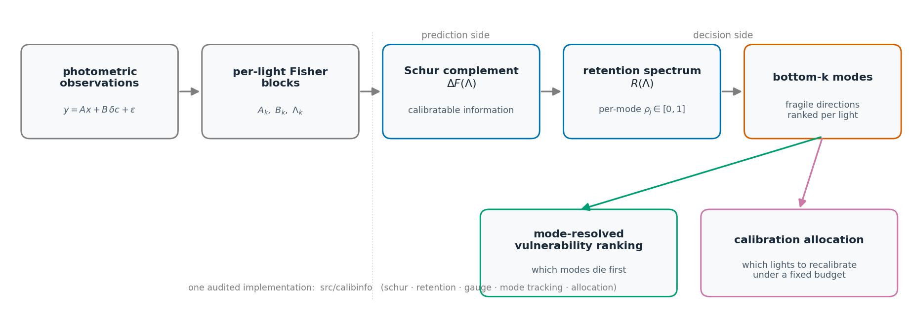
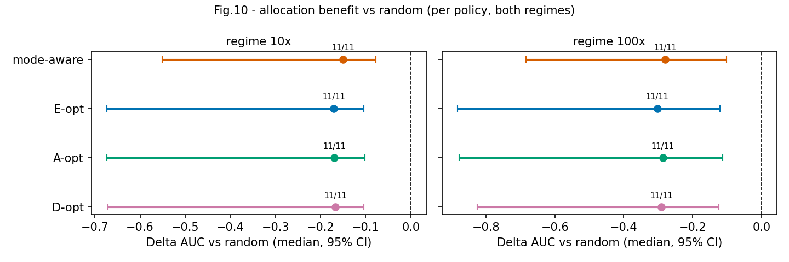

# mode-resolved-calibration

[](https://github.com/dddsx3/mode-resolved-calibration/actions)
[](LICENSE)

**calibinfo** is a Python library for mode-resolved calibration-confidence
analysis of linearized inverse problems with structured nuisance. Instead of
compressing an estimator's information content into scalar summaries (trace,
log-determinant, E-optimality), it tracks the *weakest identifiable modes* of
the Fisher information — how much usable signal survives in each fragile
direction as calibration uncertainty grows — and turns that mode-resolved
sensitivity into actionable decisions, such as which instruments to recalibrate
under a fixed budget.



## Quickstart

```python
import numpy as np
from calibinfo.information.schur import delta_f
from calibinfo.information.retention import retention_spectrum

# linearized model  y = A x + B dc + eps,  dc ~ N(0, Sigma_c)
A = ...                      # (m, n) design for the parameters of interest
B = ...                      # (m, q) design for the nuisance block
Lam = ...                    # nuisance precision  Lambda = sigma^2 * Sigma_c^{-1}

DeltaF, M, diag = delta_f(A, B, Lam)                 # Schur-complement information
R = retention_spectrum(DeltaF, Finf)                 # normalized per-mode retention
# the smallest eigenvalues of R are the fragile directions the library tracks
```

See `examples/` for complete runnable scripts — each generates its own synthetic
data and figures on the fly, no downloads required.

## Features

- **Schur-complement delta-Fisher information** `ΔF(Λ)` with a single audited
  implementation (SVD/lstsq paths; no raw solves on rank-deficient systems)
- **Calibration-retention spectrum** `R(Λ) = F∞^{-1/2} ΔF(Λ) F∞^{-1/2} ∈ [0, I]`
  with per-mode retention levels and continuous mode tracking across Λ
- **Closed-form gauge response** `aᵀΔF(λ)a = Σᵢ αᵢ² sᵢ² λ/(sᵢ²+λ)` for gauge
  directions, with the λ⋆ crossover diagnostic
- **Known-answer test suite**: LO monotonicity, rank-deficient Λ = 0 routes,
  gauge identities, per-light allocation sensitivity (analytic vs finite
  difference), brute-force greedy cross-checks
- **Information-guided calibration allocation**: per-light sensitivity kernels,
  sequential selection under a precision budget, compared against E/A/D-optimal
  greedy and random baselines
- **Deterministic paired evaluation protocol**: shared raw innovations across
  policies/budgets, object-level paired bootstrap

## Mathematical core

1. Model and nuisance priors:

   `y = A x + B δc + ε`,   `δc ~ N(0, Σ_c)`,   `Λ = σ² Σ_c⁻¹`

2. Delta-Fisher (Schur complement, the `calibratable` residual information):

   `ΔF(Λ) = Aᵀ [ I − B (BᵀB + Λ)⁻¹ Bᵀ ] A`

3. Calibration-retention spectrum:

   `R(Λ) = F∞^(−1/2) · ΔF(Λ) · F∞^(−1/2)`,   `0 ≼ R(Λ) ≼ I`

   The eigenvalues `0 ≤ ρ₁ ≤ … ≤ ρ_q ≤ 1` are per-mode retention levels; the
   weakest (bottom) modes are the smallest eigenvalues of `R(Λ)`, and the
   mode-resolved criterion tracks those bottom modes across the hyperparameter
   path.

4. Gauge spectral response (closed form):

   `aᵀΔF(λ) a = Σᵢ αᵢ² sᵢ² λ / (sᵢ² + λ)`,   `(sᵢ², V) = eig(BᵀB)`,   `α = Vᵀ c̄`

## Examples

`examples/` contains self-contained scripts that generate their own synthetic
data and figures — clone-and-run, zero downloads:

- retention spectrum and gauge response on a synthetic scene
- mode-resolved vs scalar criteria under controlled nuisance corruption
- a minimal calibration-allocation demo (small grid, runs in minutes)

## Benchmark reproduction

The `results/`, `configs/`, and `experiments/` trees hold a frozen benchmark
(OpenIllumination controlled-corruption study + DiLiGenT sanity + synthetic
validity panels) that reproduced a research manuscript; its numbers, protocol,
and provenance are documented in `docs/REPRODUCIBILITY.md` and
`docs/EXPERIMENTS.md`, guarded by `tests/test_reproduction.py`. This benchmark
is separate from the library API — the examples above never touch it.

Key frozen results (11 held-out OpenIllumination objects, 66/66 cells):

- median within-cell Spearman $R_A$ = 0.90 (object-cluster bootstrap 95% CI
  [0.90, 0.95]);
- stratified (fixed-level) median Spearman 0.536 (mode-resolved) vs 0.418
  (log-determinant) / 0.400 (trace) — per-level reversals disclosed in
  `docs/WORDING.md`;
- preregistered allocation evaluation: mode-aware guidance improves
  reconstruction over random allocation for 11/11 objects (Δ AUC −0.150 at 10×,
  −0.279 at 100×; bootstrap 95% CI excludes 0; strong grade per the
  preregistered rule — the classical E/A/D-opt baselines improve similarly,
  see `allocation_deltas.csv`).




## Installation

```bash
pip install -e .            # core (numpy, scipy)
pip install -e .[dev]       # + pytest
pip install -e .[examples]  # + matplotlib (for examples/figures)
```

Requires Python ≥ 3.10.

## Contributing

Bug reports and PRs welcome — see `CONTRIBUTING.md`. The known-answer test
suite and the claim guard (`tests/test_wording_gate.py`) run on every change.

## Citation / License

Cite via `CITATION.cff` (software citation; research paper forthcoming).
Licensed under the terms in `LICENSE`.
