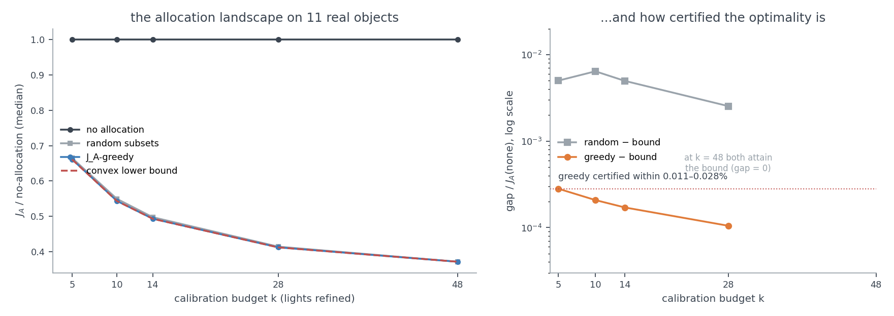
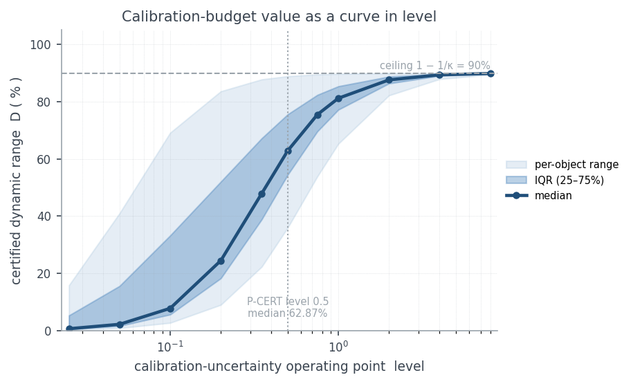
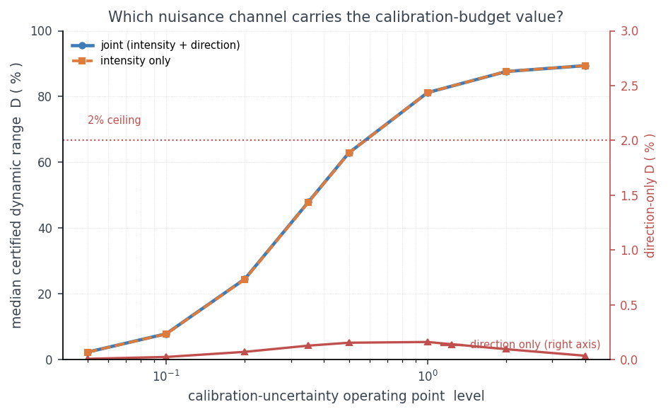
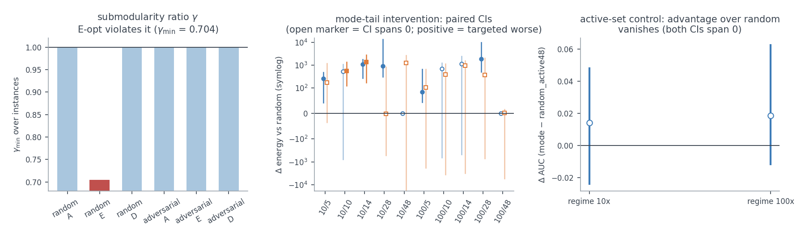

English · [简体中文](README.zh-CN.md)

# mode-resolved-calibration

[](https://github.com/dddsx3/mode-resolved-calibration/actions)
[](LICENSE)

**calibinfo** is a Python library for mode-resolved calibration-confidence
analysis of linearized inverse problems with structured nuisance. Scalar
summaries (trace, log-determinant, E-optimality) compress an estimator's
information content into one number. This library instead tracks the *weakest
identifiable modes* of the Fisher information: how much usable signal
survives in each fragile direction as calibration uncertainty grows, and
which identifiable directions and calibration components are
information-active. A downstream allocation stress test shows that
identifying the Fisher-active substructure has decision value, while no
additional performance advantage is observed for the tested
within-active-set mode ordering.

The current research direction treats **calibration uncertainty as a
designable resource**: how much is better calibration worth, where should
precision be spent, and how close is that allocation to globally optimal.
The budget-allocation problem is an exact
convex program in the per-light precision multipliers. The retention spectrum
has an exact low-rank structure that removes the sampling bottleneck. And the
optimization landscape itself — not any particular policy — is certified
(see [Research direction](#research-direction-certified-bounds-on-calibration-precision-allocation)).
The mathematical statements are collected in
[docs/methods.md](docs/methods.md); every number in this README is bound to a
committed evidence file in [docs/claims.md](docs/claims.md). The
[theory continuation index](docs/theory/README.md) separates imported evidence
from subsequent physical-model and joint-model derivations.

**Figure 1. Fragile directions, their spectrum, and what a budget buys.**
Left: per-pixel Fisher information on a real object — information is thin in
the blue region. Middle: the retention spectrum sorts the tracked directions
by how much signal survives. Right: refining a small set of lights lifts
exactly the weakest modes.


## Quickstart

```python
import numpy as np
from calibinfo.information.schur import delta_f
from calibinfo.information.retention import retention_spectrum

# linearized model  y = A x + B dc + eps,  dc ~ N(0, Sigma_c)
A = ...                      # (m, n) design for the parameters of interest
B = ...                      # (m, q) design for the nuisance block
Lam = ...                    # profiling precision  Lambda = sigma^2 * Sigma_c^{-1}
                             # (requires Sigma_c > 0; for singular Sigma_c use
                             #  delta_f_marginal / the factor path C = B L)

DeltaF, M, diag = delta_f(A, B, Lam)                 # Schur-complement information
spec = retention_spectrum(DeltaF, A.T @ A)           # normalized per-mode retention
# spec["rho"] (ascending) are the generalized retention eigenvalues on the
# identifiable subspace range(F_inf); spec["modes"] are the corresponding
# eigenvectors — the fragile directions the library tracks
```

See `examples/` for complete runnable scripts — each generates its own synthetic
data and figures on the fly, no downloads required.

## Features

- **Schur-complement delta-Fisher information** `ΔF(Λ)` with a single
  implementation (SVD/lstsq paths; never a raw solve on a rank-deficient
  system)
- **Calibration-retention spectrum** `R(Λ) = F∞^{-1/2} ΔF(Λ) F∞^{-1/2} ∈ [0, I]`
  on the identifiable subspace `range(F∞)` — dimension `r = rank(F∞)` (not the
  nuisance dimension `q`) — with per-mode retention levels and continuous mode
  tracking across Λ
- **Closed-form gauge response** `aᵀΔF(λ)a = Σᵢ αᵢ² sᵢ² λ/(sᵢ²+λ)` for gauge
  directions, with the λ⋆ directional crossover precision diagnostic
  (existence condition `0 < μ < ‖Aa‖²`; within-scene interpretation only).
  Scope: this is an *information* statement — the downstream task variance
  is the inverse form `aᵀΔF⁻¹a`, which it does not directly give
  (methods.md §4 scope note, §10 for the law that does)
- **Singular-covariance-safe marginal routes**: `delta_f_marginal` and the
  covariance-factor path `Σ_c = LLᵀ, C = BL` handle any proper `Σ_c ⪰ 0`
- **Known-answer test suite**: LO monotonicity, rank-deficient Λ = 0 routes,
  gauge identities, per-light allocation sensitivity (analytic vs finite
  difference), brute-force greedy cross-checks, retention-covariance theorem,
  allocation rank invariance
- **Information-guided calibration allocation**: per-light sensitivity kernels,
  sequential selection under a precision budget, compared against E/A/D-optimal
  greedy (A/D on the positive subspace as implemented) and random baselines.
  The tested mode-aware ordering is an adaptive normalized weak-Fisher-mode
  sensitivity heuristic, not an exact retention-gradient optimization
- **Deterministic paired evaluation protocol**: shared raw innovations across
  policies/budgets, object-level paired bootstrap

## Mathematical core

1. Model and nuisance priors:

   `y = A x + B δc + ε`,   `δc ~ N(0, Σ_c)`,   `Λ = σ² Σ_c⁻¹` (Σ_c ≻ 0)

   `Λ` is a **profiling precision** (the PSD penalty matrix of the quadratic
   `cᵀΛc`; its null directions are flat/unpenalized). For a *singular* proper
   Gaussian covariance — whose null directions mean "almost surely zero", the
   opposite semantics — use the covariance-factor marginalization
   `Σ_c = LLᵀ, c = Lz, C = BL` (`delta_f_marginal`, `nuisance_factor`), never a
   pseudoinverse-precision substitution.

2. Delta-Fisher (Schur complement, the `calibratable` residual information):

   `ΔF(Λ) = Aᵀ [ I − B (BᵀB + Λ)⁻¹ Bᵀ ] A`

3. Calibration-retention spectrum (generalized eigenvalue problem
   `ΔF v = ρ F∞ v`, restricted to `𝒳 = range(F∞)`):

   `R(Λ) = F∞^(−1/2) · ΔF(Λ) · F∞^(−1/2)`,   `0 ≼ R(Λ) ≼ I`

   The eigenvalues `0 ≤ ρ₁ ≤ … ≤ ρ_r ≤ 1`, `r = rank(F∞)`, are per-mode
   retention levels; the weakest (bottom) modes are the smallest eigenvalues of
   `R(Λ)`, and the mode-resolved criterion tracks those bottom modes across the
   hyperparameter path. ρ_j is a generalized Rayleigh quantity `v_jᵀΔFv_j /
   v_jᵀF∞v_j` — not a ratio of ordinary eigenvalues of the two matrices. Under
   the matched linear-Gaussian GLS ensemble, `1/ρ_j` is exactly the variance
   inflation of the normalized dual error coordinate
   `z_j = u_jᵀ F∞^{1/2}(x̂ − x)` (`F∞^{1/2} Cov(x̂) F∞^{1/2} / σ² = R⁻¹`).

4. Gauge spectral response (closed form):

   `aᵀΔF(λ) a = Σᵢ αᵢ² sᵢ² λ / (sᵢ² + λ)`,   `(sᵢ², V) = eig(BᵀB)`,   `α = Vᵀ c̄`

## Examples

`examples/` contains self-contained scripts that generate their own synthetic
data and figures — clone-and-run, zero downloads:

- retention spectrum and gauge response on a synthetic scene
- mode-resolved vs scalar criteria under controlled nuisance corruption
- a minimal calibration-allocation demo (small grid, runs in minutes)
- a two-question guided tour: which directions are fragile, and what a
  recalibration budget buys (certified) — shown below

**Figure 2. The two questions the library answers.** Which parameter
directions are fragile, and what does a recalibration budget buy — with a
certified lower bound on the answer (synthetic demo, generated by
`examples/ex4_calibration_tour.py`).


## Benchmark reproduction
**Entry point:** `./reproduce.sh` reproduces the chain in stages —
`--stage synthetic` (no raw data), `--stage diag` (zero-cost diagnostics on
the committed artifacts), `--stage oi` / `--stage dq` (raw-data experiments;
long runs behind `--long`), `--stage figures`. Each step prints the `gate`
name of the artifact it produces so a runner can cross-check against
`results/`; absent raw data produces explicit SKIPs. `--list` prints the
runner table.


The `results/`, `configs/`, and `experiments/` trees hold a frozen benchmark
(OpenIllumination controlled-corruption study + DiLiGenT sanity + synthetic
validity panels) whose numbers, protocols, and provenance are documented in
`docs/REPRODUCIBILITY.md` and `docs/EXPERIMENTS.md`, guarded by
`tests/test_reproduction.py`. This benchmark is separate from the library API
— the examples above never touch it.

Key results (11 held-out OpenIllumination objects). The frozen analyses use
`legacy` or `corrected` conventions as recorded in their artifacts. **B1 and
B2 below use the imported per-seed gauge rerun**, not the earlier corrected
summary; both earlier pipeline versions remain immutable historical records
(see [docs/EXPERIMENTS.md](docs/EXPERIMENTS.md) §11).

- **Amplitude comparison (B2; projection-matched, not ensemble-matched)**:
  corrected arm D has empirical/same-projection linear-prediction ratio
  median 53.744194 (5–95% [0.489414, 820.342156]), bound to
  `variants.D.new_ratio_matched_prediction.pooled` in
  [`amplitude_comparison.json`](results/theory_extension_20260918/imported_20260917/amplitude_comparison.json).
  The prediction matches the per-seed gauge projection and dual coordinate,
  but the empirical denominator is a **residual bootstrap**, not the matched
  GLS calibration-limit ensemble. Deviation from one therefore neither
  validates nor refutes the matched-GLS variance theorem; the synthetic
  matched-MC reference remains 1.0045.

  **Historical amplitude summaries (superseded)**: the earlier arm-D median
  15.98 and original arm-A median 201.1 are retained in
  `results/magnitude/directional_amplitude_summary.json`, not used as current
  B2 estimates or as evidence of theorem failure.

- **Historical validity map (B8; superseded projection pipeline)**: the
  archived map reported curvature-bin median Spearman ≥ 0.8 and Kendall
  sign agreement ≥ 0.7, with magnitude ratios increasing with curvature
  (`results/magnitude/validity_map.json`). These are historical ordering
  readouts, **not a robustness guarantee for the current per-seed gauge
  projection**. They do not establish that linearization failure affects
  magnitudes but never directions in the updated pipeline;
- **Decision quality**: on the physical reconstruction endpoint (normal
  angular error from the single frozen residual pipeline, extended with a
  one-step normal refit), the information-theoretic allocation beats BOTH
  random baselines with bootstrap CIs excluding zero — by several degrees
  against universe-random, and by 0.38–1.40° against active-set-restricted
  random on the feasible budget interval (the honest control): the headline
  is mostly the active-set
  effect. On the **feasible budget interval** (k ≤ 48; the frozen grid's
  k=57/85/114 exceed the active-set size, where both sides pick the same
  lights and the comparison is vacuous — flagged degenerate in
  `results/openillumination/decision_quality_feasible.json`) the
  within-active-set advantage is −0.38…−1.40°, ~2.5× smaller than the
  universe-random advantage. The
  predicted J_A ordering predicts the realized ordering in 88/88
  object×level×regime cells (informed-only pooled sign agreement 0.687
  [0.657, 0.716]) — while the gauge-aligned weak-mode endpoints show the
  error-redistribution phenomenon instead
  (`results/openillumination/decision_quality.json`);
- preregistered allocation evaluation **on the E_osb endpoint** (the
  gauge-aligned residual energy projected onto the predicted weak-mode
  subspace — a model-space quantity, NOT the physical reconstruction error):
  mode-aware guidance improves the budget-curve E_osb over random allocation
  for 11/11 objects (Δ AUC −0.150 at 10×,
  −0.279 at 100×; bootstrap 95% CI excludes 0 — an actionable outcome vs
  random; the classical E/A/D-opt baselines improve similarly). In post-hoc
  paired comparisons the classical baselines achieved modestly lower AUC than
  the mode-aware policy (paired bootstrap 95% CIs exclude 0 in both regimes;
  median paired difference +0.019 to +0.027 AUC). The `random_active48` control
  — uniform permutations over the 48 Fisher-active lights only — removes the
  advantage over random entirely (Δ +0.014 / +0.019, CIs spanning 0), so the
  measured benefit of every informed policy over full-universe random is an
  active-set effect rather than a mode-ordering effect (see
  `allocation_policy_pairwise.csv` and `allocation_random48_summary.json`).
  **This bullet and the Decision-quality bullet above are different
  functionals and do not share a conclusion:** on the E_osb endpoint the
  within-active-set ordering adds nothing detectable, while on the physical
  normal-angular-error endpoint it is real with CIs excluding 0 (−0.38…−1.40°,
  feasible interval). Do not quote either endpoint as the general answer.
- **Retention-ordering control (B1; current per-seed gauge rerun)**: median
  within-cell Spearman $R_A$ = 0.55 (object-cluster bootstrap 95% CI [-0.1,
  0.7]; 43/66 cells positive, 7/11 objects positive), from `variants.D` in
  [`mf0_factorial_summary.json`](results/theory_extension_20260918/imported_20260917/mf0_factorial_summary.json).
  This is `gauge_mode=per_seed`, `prediction_field=pred_deg`: the **original
  prediction ordering control**, not matched-prediction validation. Its CI
  spans zero; it does not establish robust directional validation, let alone
  validate the magnitudes `1/ρ_j`.

  **Historical B1 (superseded)**: $R_A$ = 0.90 (CI [0.7, 0.95]; 65/66 cells
  positive, 11/11 objects positive) belongs to the earlier corrected artifact
  `results/openillumination/correctness/mf0_factorial_summary.json`. Its
  exact mode-index equivalence (66/66 cells, deviation 0.0) was a within-scene
  construction identity, not out-of-sample evidence for the current pipeline.

**Figure 3. Benchmark evidence.** Left: per-level severity medians under
controlled corruption (mode-resolved vs scalar criteria). Middle: pooled
association across levels. Right: paired policy comparison forest plot —
the informed-policy advantage over random is an active-set effect (CIs
span 0 against the active-set control).


### Correctness & integrity

**Evidence-version scope.** The noise-fit and dual-coordinate `legacy` /
`corrected` factorial remains a frozen reproducibility anchor. B1 and B2 now
use the separately imported **per-seed gauge correction**, whose manifest
pins the evidence source. A legacy machinery match does not make the updated
empirical outputs equal to the old summaries. Other frozen analyses retain
only their explicitly recorded conventions and scope — see
[docs/EXPERIMENTS.md](docs/EXPERIMENTS.md) §11 and
[docs/REPRODUCIBILITY.md](docs/REPRODUCIBILITY.md).

## Research direction: certified bounds on calibration-precision allocation

The active research program addresses a question that survives the negative
results above:

> **How much can calibration-precision allocation buy at all?** The
> budget-allocation problem is reformulated as an exact convex program in the
> per-light precision multipliers, and the *optimization landscape itself* is
> certified — with Frank–Wolfe duality-gap certificates and exact dynamic-range
> bounds, independent of any particular selection policy.

### The four-layer pipeline

The program is organized as four layers, each with its own object, question,
and committed evidence:

| Layer | Object | Question it answers | Evidence |
|---|---|---|---|
| **Diagnosis** | `R = F∞^{-1/2} ΔF F∞^{-1/2}` | Which identifiable directions are hurt by calibration uncertainty? | `docs/methods.md` §3 (matched GLS); current B1 `variants.D` ordering control below, not matched-prediction validation |
| **Valuation** | `V(B) = 1 − J*(B)/J₀` | What is better calibration worth? | `results/certification/certified_gaps_levels.json` (the level curve) |
| **Decision** | `t*(B) = argmin J_A(t)` | Where exactly should the budget be spent? | `results/certification/certified_gaps.json` (greedy prefix) |
| **Certification** | `J_A(t) − J* ≤ g_FW(t)` | How far from optimal is that allocation? | `results/certification/certified_gaps.json` (FW gap) |

Diagnosis identifies the fragile modes; Valuation prices the calibration
budget as a curve in the operating point; Decision allocates it; Certification
bounds the distance to the global optimum. The layers are separable — the
certificates hold for *any* candidate allocation, not only the greedy one.

**Goal-oriented value (which task is the calibration for?).** The value
layer extends to downstream tasks: for task operators `H` (linear functionals
of the parameter estimate), `J_H = tr(H ΔF⁻¹Hᵀ)` prices the *same*
calibration state per task (low-rank push-through route; `methods.md` §10).
The frozen photometric pipeline uses **additive albedo** coordinates
(`A_k = diag(s_hat_k)`), not log-albedo. Its scalar task table does not measure
joint albedo/normal uncertainty: with unit normals the joint intrinsic model
has **3P** coordinates (albedo plus two normal-tangent coordinates per pixel),
not an unconstrained 4P model; see the joint-model extension in `methods.md`.
On the 11 held-out objects the same uniform refinement at level 0.5 buys a
median 62.87% dynamic range for the all-parameter A-opt functional — the
certified P-CERT headline, reproduced by the new route as a cross-check —
but 89.76% for the mean-albedo task (at level 0.1: 7.82% vs 87.93%), and
the per-light gain rankings under the two tasks disagree (median Spearman
0.936; top-3 light sets disjoint in 11 of 44 object×level cells) —
`results/goal_oriented/goal_orientation.json`. The mean-task saturation of
the universal ceiling is not a coincidence: the albedo-weighted mean
functional is *exactly* gauge-aligned with the light-intensity nuisance
component, and the closed form `V = (1−1/κ)/(1+q·r)` predicts its value
curve to a median 0.0008 (`gauge_mechanism_rho_mean`; methods.md §10).

Three structural findings anchor it (verified by
`tests/test_math_foundations.py`; no raw data required):

1. **Exact low-rank structure** — with per-light block-diagonal nuisance, the
   `P × 3L` factor `V` gives exactly `P − rank(V)` modes pinned at ρ = 1;
   this is `P − 3L` only when `rank(V) = 3L`. The non-unit modes come from
   the positive eigenvalues of `VᵀV`, so a `3L × 3L` eigenproblem recovers
   the full spectrum without double-counting the skinny Gram matrix's zero
   modes. This removes the pixel-subsampling bottleneck (full resolution,
   all 142 lights, on a laptop).

   **Figure 4. The full spectrum from a 3L×3L eigenproblem.** The dense
   P×P spectrum (solid) and the low-rank route (dashed) coincide to machine
   precision; exactly P − rank(V) modes sit at ρ = 1 (P − 3L only at
   full column rank).

   

2. **Convex certificate functional** — the E-optimal certificate functional
   `J_E = −λ_min(ΔF(t))` is convex in the precision multipliers on the boxed
   design region (midpoint convexity: 400/400 random pairs), so Frank–Wolfe
   duality gaps provide genuine global optimality certificates for the
   allocation problem.

3. **Certified optimality gaps on the real objects** — under the
   preregistered protocol `P-CERT`
   (`results/certification/certified_gaps.json`, 11 real objects × 5 budget
   levels): the certified dynamic range of `J_A = tr ΔF⁻¹` between no
   allocation and refining all 48 Fisher-active lights is **36–89% per
   object (median 62.87%)** — allocating the calibration budget genuinely
   matters, and the answer is instance-dependent enough that per-instance
   certification is the right tool. The J_A-greedy prefix is certified
   within **0.011–0.028%** of the convex lower bound at every budget
   (essentially optimal), while seeded random subsets sit 0.25–0.64% above
   it. The earlier policy-comparison null results sit within this remaining
   margin. See also the submodularity counterexample harness and the
   amplitude validity envelope. **Full-resolution
   confirmation** (`results/certification/lowrank_fullres.json`): recomputing
   the certified table on ALL masked pixels (P = 3559–10252) with all 142
   lights via the exact low-rank route gives dynamic range 27.3–89.4%
   (median 60.06%) and greedy within 0.002–0.005% of the lower bound — the
   subsampled table was not a sampling artifact. The dynamic range is a
   **curve in the calibration-uncertainty operating point `level`**, not a
   single number: re-sampling the same functional across an 11-point grid
   (`results/certification/certified_gaps_levels.json`) gives median D =
   0.7% at level 0.025 rising to 89.85% at level 8.0 (37× span), with
   median 62.87% at the P-CERT operating point level = 0.5 — see the
   certified-value curve below.
   **Read the `level` axis correctly:** `level` is the **injected synthetic
   calibration-uncertainty scale** added to the nominal whitened system in
   `experiments/` — it is a controlled operating point, **not** an
   uncertainty estimated from real calibration data, and has **no physical
   calibration anchor**. The dynamic-range headlines (including 62.87%) are
   conditional on this `level`; the ceiling D ≤ 1−1/κ is a structural bound,
   not a fitted operating-point value. The curve is the honest way to state
   the dependence rather than a single point. This answers how the result
   changes with calibration uncertainty; see `docs/claims.md` and
   `docs/methods.md` §7 for the conditional-variable discipline.

   **γ guarantee scope (M9/M12).** The alpha-only candidate is **refuted**,
   not merely unproved; the former real-object γ ≥ 0.635 guarantee is
   **withdrawn**. Historical `gamma_lower_bound(alpha)` values and archived
   tests retain their numeric behavior for reproduction only, not as valid
   certificates. The proved replacement M12 is the leave-one-out spectral
   bound implemented by
   `calibinfo.allocation.alpha_bound.spectral_gamma_lower_bound(A, updates)`:
   **unweighted full trace, a fixed SPD parameter space, and PSD updates**.
   It does not directly cover arbitrary task weights, singular baselines, or
   changing identifiable subspaces. No replacement real-object spectral
   readings are reported here; see `docs/methods.md` §9.


   **Figure 5. Certified optimality gaps.** Left: the J_A landscape over the
   calibration budget (median across the 11 objects). Right: the greedy
   prefix stays within a fraction of a percent of the convex lower bound —
   the certification is not just asymptotic.

   

   Certified value curve (median with IQR and per-object ranges, log
   x-axis; saturates toward the universal ceiling 1 − 1/κ = 90% at large
   level — the same ceiling the level=64 table meets, docs/methods.md §7):

   

   **Channel decomposition.** The calibration-budget value is carried by
   the **intensity** channel alone: the intensity-only rows reproduce the
   joint dynamic range at every level (median |joint − intensity| < 0.05 pp
   at level 0.5, `results/openillumination/channel_decomposition.json`),
   while the direction channel contributes ≤ 2% everywhere (max 1.68% at
   obj_19_cylinder @ level 0.2) with a non-monotone, hump-shaped profile in
   level — the tracked fragile *directions* contribute diagnosis, not
   magnitude, to the calibration-budget value.

   

   **Σ_φ parameter-family sensitivity (P-SIGMA-FAMILY).** Replacing the
   single-line parameterization (forced logI/dir variance ratio ~3283)
   with a preregistered 3-axis family — independent channel ratio
   (σ_dir up to 25°), per-light heterogeneity (het up to 1.0), channel
   coupling (|ρ| ≤ 1, PSD-valid) — separates the robust conclusions from
   the parameterization-specific ones
   (`results/openillumination/corruption_family_sensitivity.json`,
   `results/magnitude/linearization_radius_family.json`): the
   **intensity dominance is robust** (direction share at the operating
   point 0.07%; the 2% threshold is never reached even at σ_dir = 25°,
   11/11 objects censored); the **universal ceiling holds across the
   family** (theorem, runtime-guarded: max violation −0.0028 over 495
   rows); the **two-term law is valid exactly where the value lives** —
   median |dV| 0.0076, and the worst intensity-carrying cell (0.048)
   stays at the frozen envelope; the blow-ups (max 0.464) sit in the
   direction-only region that the D finding already excludes; and the **linearization radius
   is channel-dependent** (joint and intensity-only: 1.0/1.5, frozen
   values bit-exact; direction-only never leaves first-order scaling;
   het = 1.0 shrinks the radius 5× — per-light calibration
   heterogeneity breaks the nominal linearization ~5× earlier than any
   uniform-scale corruption of the same total variance). All family machinery reproduces the
   frozen artifacts bit-exactly in the degenerate anchor (264/264
   channel-decomposition rows, plus per-point anchors). The **informed-ordering validity
   (E) is parameterization-specific**: the control reproduces the frozen
   subset exactly (88/125 = 0.704); direction-heavier corruption makes
   the predicted orderings MORE faithful (0.889), but per-light
   heterogeneity breaks them below chance (0.353, per-cell Spearman
   median −0.78) — and the zero-cost cross diagnosis excludes
   σ misspecification as the cause: handing the predictor the true
   per-light σ moves its ordering by only 0.05 (S_pred = 0.949) while
   the realized-benefit ordering is fully re-ordered (S_real = −0.325)
   — truth-end decoupling, so the per-light ordering loses validity
   under heterogeneity regardless of σ specification
   (`results/openillumination/decision_quality_family.json` +
   `corruption_family_e_diag.json`).

   **Physical anchor (P-BALL-ANCHOR).** Running a standard sphere
   photometric-stereo calibration on DiLiGenT ballPNG (96 lights, GT
   normals) and anchoring Σ_φ to its MEASURED errors — direction RMS
   2.96°, log-intensity std 0.0159 — shows the real procedure's
   direction variance is ~10.6× its intensity variance, the OPPOSITE of
   the joint parameterization's forced 3283. At that measured anchor the
   direction channel carries a median 36% of the budget value
   (D-flipped, preregistered rule): the intensity-dominance conclusion
   is parameterization-robust but not empirically universal — the value
   of better calibration depends on where the calibration procedure's
   errors actually live (a **channel-conditionality criterion**, both
   regions empirically instantiated: synthetic family sweep + real
   measured anchor; the S1 sweep's fixed σ_logI ∈ {0.05…1.0} is what
   held the intensity dominance up — the anchor sits 3.1× below the
   sweep floor; the flip also spans 4.8%–71.4% across objects)
   (`results/openillumination/ball_anchor.json`).

   **Second dataset (P-DILIGENT-QUEUE, loader-corrected).** On
   DiLiGenT (10 objects, 96 lights, independent capture rig): the
   **linearization envelope transfers exactly** (radius_2x median 1.0,
   all objects in [0.75, 1.5]; radius_10x = 1.5 on 10/10) and the
   **intensity-dominance channel split also transfers** (direction max
   D 0.20% vs OI's 1.68%; intensity reproduces joint to <0.05 pp).
   What stays conditional: the ball-anchor direction share differs by
   cohort/object at the same measured profile (OI median 36% over
   4.8–71.4% vs DiLiGenT ≈0 with cat 22%/pot1 29% as the high objects).
   **Mechanism (P-ANCHOR-MECHANISM).** The object-level direction share
   is monotone in a scene statistic computed without the D functional —
   the direction-vs-intensity nuisance energy ratio in the weak-mode
   subspace (pooled Spearman −0.899; −0.927 within OI, −1.000 within
   DiLiGenT): the cohort difference is a consequence of scene geometry,
   not of the datasets per se.
   *Correction note:* an earlier version of this paragraph reported
   "channel split does not transfer" and large pot1/pot2 anchor shares —
   those were artifacts of a loader that dropped DiLiGenT's per-light
   intensity normalization; fixed, gate-enforced, and withdrawn
   (field paths + date: `results/diligent/provenance/`
   `loader_normalization_fix.json`).

   **Baseline (P-BASELINE, active-set-controlled).** A
   Drbohlav–Chantler-style well-conditioned-configuration selection
   (greedy farthest-point direction sampling — pure geometry) with the
   candidate pool restricted to illuminating lights, against
   active-restricted random controls (the C8-mandated frame): **on
   OpenIllumination geometry helps but does not replace the model**
   (dc05_active 5.24°/4.00° vs randomA48 5.78–5.99°/4.49–5.25° vs
   e_opt 4.52°/2.89°); **geometry-only selection carries real value on
   BOTH acquisition systems** (DiLiGenT, loader-corrected: dc05_active
   −0.33° and informed −0.27°/−0.37° vs active-restricted random, both
   beating it), while the calibrated model's incremental margin over
   geometry is large on OI and marginal (≤0.03°) on DiLiGenT.
   *Correction note:* the earlier "the model's per-light ordering does
   not transfer" reading (a_opt losing to random) was an artifact of
   the DiLiGenT loader's missing intensity normalization and is
   withdrawn. The v1 all-pool DC05's chance-level performance was the
   visibility confound (36–86% of its budget on non-illuminating
   lights, overlap recorded; 88 OI rows bit-anchored to the frozen
   E-arm; `results/baseline/baseline_comparison.json`).
4. **Mode-tail targeted intervention: no detectable advantage over scalar
   targeting** — the preregistered three-arm comparison (`P-ALLOC2 v1.1`,
   `results/mode_tail/allocation_mode_tail.json`) finds that the
   mode-resolved targeted arm and the scalar-OED targeted arm are
   statistically indistinguishable (7 of 8 informative cells span 0; the
   100/14 cell is significantly positive, i.e. the targeted arm is worse).
   The mode decomposition adds diagnostic insight (which directions are
   fragile) but not incremental allocation value over simple scalar
   criteria.

   **Figure 6. Registered negative results.** Left: E-optimal gains violate
   submodularity (adversarial search with a reproducible harness). Middle:
   the mode-tail intervention CIs against random (open markers span zero).
   Right: the active-set control removes the advantage over random entirely.

   

All certified analyses commit their `configs/` before running; the
benchmark above stays untouched.

## Installation

```bash
pip install -e .            # core (numpy, scipy)
pip install -e .[dev]       # + pytest
pip install -e .[examples]  # + matplotlib (for examples/figures)
```

Requires Python ≥ 3.10.

## Contributing

Bug reports and PRs welcome — see `CONTRIBUTING.md`. The known-answer test
suite and the claims guard (`tests/test_claims_gate.py`) run on every change.

## Citation / License

Cite via `CITATION.cff`.
Licensed under the terms in `LICENSE`.
