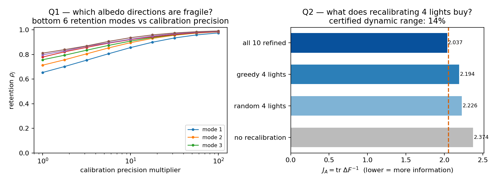

# mode-resolved-calibration（模式级标定敏感度分析）

[](https://github.com/dddsx3/mode-resolved-calibration/actions)
[](LICENSE)

中文说明 | [English](README.md)

**calibinfo** 是一个分析"带标定不确定度的线性化逆问题"的 Python 库。它不把估计器的信息量压成一个标量（trace、log-行列式、E-最优性），而是追踪 Fisher 信息中**最脆弱的可辨识方向**：随着标定不确定度增大，每个脆弱方向上还剩多少可用信息（retention 谱），以及把标定预算花在哪些灯/分量上最值（凸程序 + 认证下界）。

典型场景：光度立体、多光照重建等依赖辐射标定的逆问题——只要问题能局部线性化成 `y = A x + B δc + ε`（δc 是标定/干扰参数），就能用这套工具。



## 回答两个问题

1. **诊断**：哪些可辨识参数方向最脆弱？它们如何随标定精度恢复？
2. **决策**：只够重新标定 k 个分量时，能换来多少信息？选哪几个有区别吗？（用凸优化对偶间隙给出**全局认证**的回答，而不是只报一个策略排名）

## 安装

```bash
pip install -e .            # 核心（numpy、scipy）
pip install -e .[dev]       # + pytest
pip install -e .[examples]  # + matplotlib（示例/图）
```

需要 Python ≥ 3.10。

## 快速上手

```python
import numpy as np
from calibinfo.information.schur import delta_f
from calibinfo.information.retention import retention_spectrum

# 线性化模型  y = A x + B dc + eps,  dc ~ N(0, Sigma_c)
A = ...                      # (m, n) 关注参数的设计矩阵
B = ...                      # (m, q) 标定/干扰参数的设计矩阵
Lam = ...                    # 剖分精度 Lambda = sigma^2 * Sigma_c^{-1}
                             # （要求 Sigma_c > 0；奇异 Sigma_c 走
                             #  delta_f_marginal / 因子路线 C = B L）

DeltaF, M, diag = delta_f(A, B, Lam)       # Schur 补信息
spec = retention_spectrum(DeltaF, A.T @ A) # 逐模式保留率
# spec["rho"] 升序为可辨识子空间 range(F∞) 上的广义保留特征值；
# spec["modes"] 是对应特征向量——库所追踪的脆弱方向
```

## 方法要点

1. **有效信息（Schur 补）**：`ΔF(Λ) = Aᵀ[I − B(BᵀB+Λ)⁻¹Bᵀ]A`，单一实现
   （SVD/lstsq 路径，秩亏不裸解）。
2. **保留谱（广义特征值）**：`R(Λ) = F∞^{-1/2} ΔF F∞^{-1/2} ∈ [0, I]`，
   维数 `r = rank(F∞)`（不是干扰维数 q）；`ρ_j` 是广义 Rayleigh 量，
   不是两个矩阵普通特征值之比。
3. **协方差定理**：matched GLS 下 `F∞^{1/2} Cov(x̂) F∞^{1/2}/σ² = R⁻¹`，
   即 `1/ρ_j` 是归一化对偶误差坐标 `z_j = u_jᵀ F∞^{1/2}(x̂ − x)` 的方差
   放大倍数。
4. **预算分配是凸程序**：ΔF 对逐灯精度乘子联合算子凹 ⇒ 标准 OED 泛函
   凸 ⇒ Frank–Wolfe 对偶间隙给出全局认证下界；低秩结构
   `R = I − VVᵀ`（恰 P−3L 个 ρ≡1）让全分辨率计算可行。
5. **奇异协方差**：零协方差 ≠ 零精度——奇异 Σ_c 走因子分解/边缘化路线，
   禁止用伪逆精度替换（库内有已知答案反例）。

完整推导见 [docs/methods.md](docs/methods.md)。

## 示例

`examples/` 下四个自包含脚本（自带合成数据，克隆即跑）：

| 脚本 | 演示内容 | 输出 |
|---|---|---|
| `ex1_retention_gauge.py` | 保留谱 + gauge 响应闭式 | `retention_gauge.png` |
| `ex2_mode_vs_scalar.py` | 脆弱模式判据 vs trace/logdet 标量 | `mode_vs_scalar.png` |
| `ex3_allocation_demo.py` | 迷你标定分配实验（多策略贪心） | `allocation_demo.png` |
| `ex4_calibration_tour.py` | 两问导览：脆弱方向 + 预算价值的认证回答 | `calibration_tour.png` |

## 基准与认证结果（11 个留出 OpenIllumination 物体）

结果文件与复现命令的完整索引见 [docs/claims.md](docs/claims.md)
（声明 → 证据文件 → 复现命令 → 验收测试），复现指南见
[docs/REPRODUCIBILITY.md](docs/REPRODUCIBILITY.md)。摘要：

- **方向性验证**：细胞内 Spearman R_A = 0.90（bootstrap 95% CI
  [0.7, 0.95]，65/66 细胞、11/11 物体为正）。构造性说明：该统计量在
  细胞内等价于按模式序号排序（66/66 细胞偏差恰为 0）——它验证的是
  **方向**（理论标出的弱方向确实是经验上更脆的方向），不验证幅值；
- **幅值有效域**：真实数据 emp/pred 中位 201.1（合成 matched MC 为
  1.0045）——线性化理论在真实光度数据上的可证伪有效域；
- **认证动态范围**：全部 masked 像素、全部 142 灯下，重标所有 48 个
  有效灯可带来 **27.3–89.4%（中位 60.06%）** 的 tr ΔF⁻¹ 改善，逐物体
  差异大——所以按实例认证；J_A-greedy 距凸下界仅 **0.002–0.005%**；
- **靶向干预显著**：把预算按理论敏感性花在最弱 tracked modes 上，被
  靶向模式的对偶坐标能量在**全部 10 个（regime, budget）单元、11/11
  物体**显著下降（配对 bootstrap CI 全排除 0）；
- **注册的负结果**：E-opt 增益违反次模性（γ_min = 0.704）；跨物体
  severity 分支已退役（修正管线翻转 + P_mode ≡ P_emin 标量化恒等）；
  策略排序差异全部落在认证 epsilon 内。

## 复现与完整性

- `checksums.sha256` 钉住**每一个**提交文件的哈希（CI 强制校验）；
- 每个实验预注册（config 先于运行提交）、带 manifest（git SHA、种子、
  口径）；
- 复现命令、证据文件与验收测试的对应表见
  [docs/REPRODUCIBILITY.md](docs/REPRODUCIBILITY.md)；
- 流水线有两个口径：`legacy`（逐位复现原始基准产物）与 `corrected`
  （文档化的修正口径，报告数字所用）；A/B/C/D factorial 验证两者关系
  （原始口径逐位复现 + 修正口径重测所有头条）。

## 贡献

Bug 报告与 PR 欢迎——见 `CONTRIBUTING.md`。已知答案测试与声明门
（`tests/test_claims_gate.py`）在每次改动时运行。

## 引用 / 许可

软件引用见 `CITATION.cff`（研究论文撰写中）。许可见 `LICENSE`。
